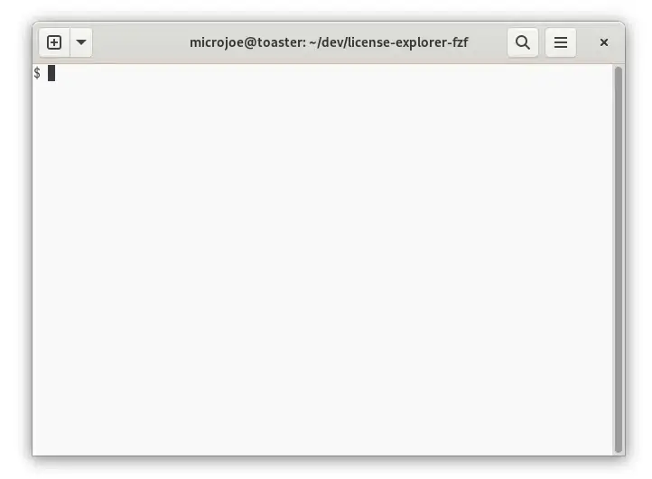

<!--
SPDX-FileCopyrightText: 2022 Agathe Porte <microjoe@microjoe.org>

SPDX-License-Identifier: MIT
-->

# License explorer

Using FZF to explore and select software licenses.

This is a toy project to explore and select software licenses using:

- [fzf tool](https://github.com/junegunn/fzf);
- [jq tool](https://github.com/stedolan/jq);
- [SPDX license list data](https://github.com/spdx/license-list-data) (submodule); *and*
- POSIX shell.

## License

This project is licensed under [MIT](LICENSES/MIT.txt) license.